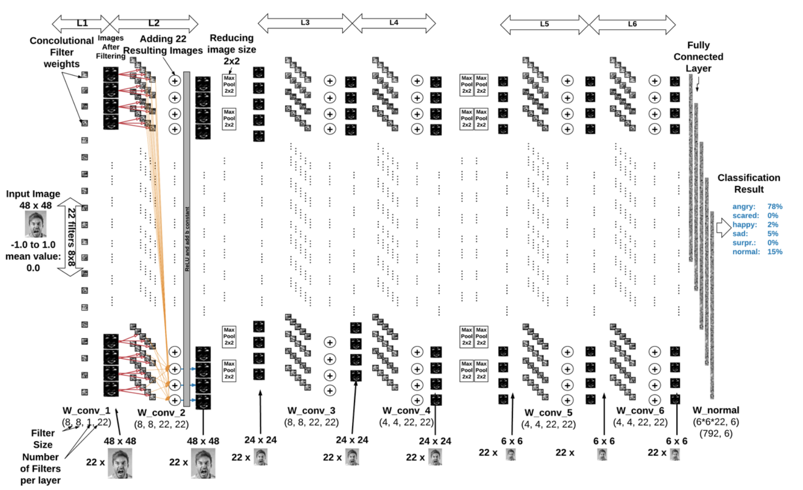
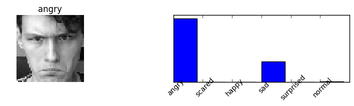
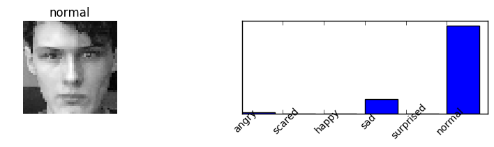
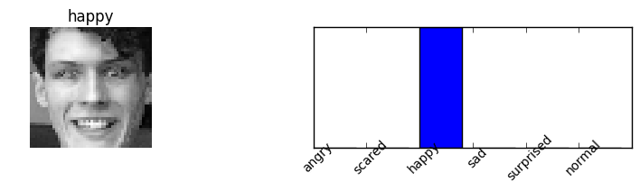

## Facial Emotion Recognition

It is a trained CNN on a dataset of 35k labeled faces to teach facial emotions. 
It was coded as a project for NTDS subject at EPFL, 2016. 
The CNN was implemented in python/tensorflow with 7-later CNN with dropouts, max-pooling. To run the code(*.ipynb) Jupyter Notebook is required. 

Overview of the CNN:

 
Example results: 

The dataset is taken from kaggle competition:

References:
"Challenges in Representation Learning: A report on three machine learning
contests." I Goodfellow, D Erhan, PL Carrier, A Courville, M Mirza, B
Hamner, W Cukierski, Y Tang, DH Lee, Y Zhou, C Ramaiah, F Feng, R Li,
X Wang, D Athanasakis, J Shawe-Taylor, M Milakov, J Park, R Ionescu,
M Popescu, C Grozea, J Bergstra, J Xie, L Romaszko, B Xu, Z Chuang, and
Y. Bengio. arXiv 2013.

Authors of the project:
Patryk Oleniuk, Carmen Galotta
